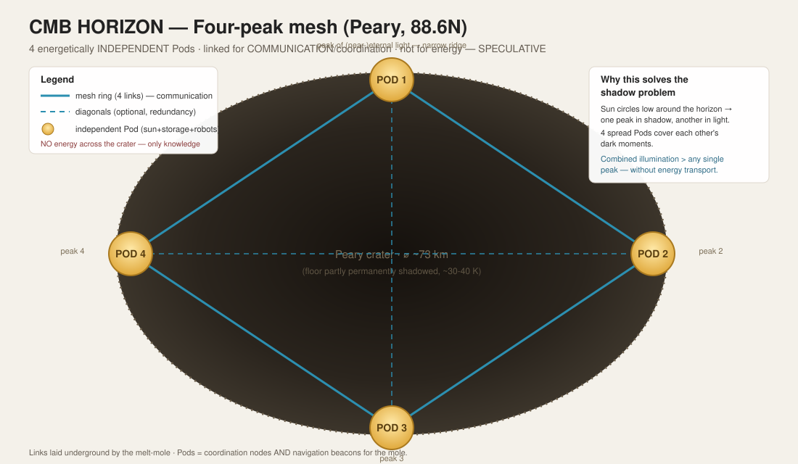
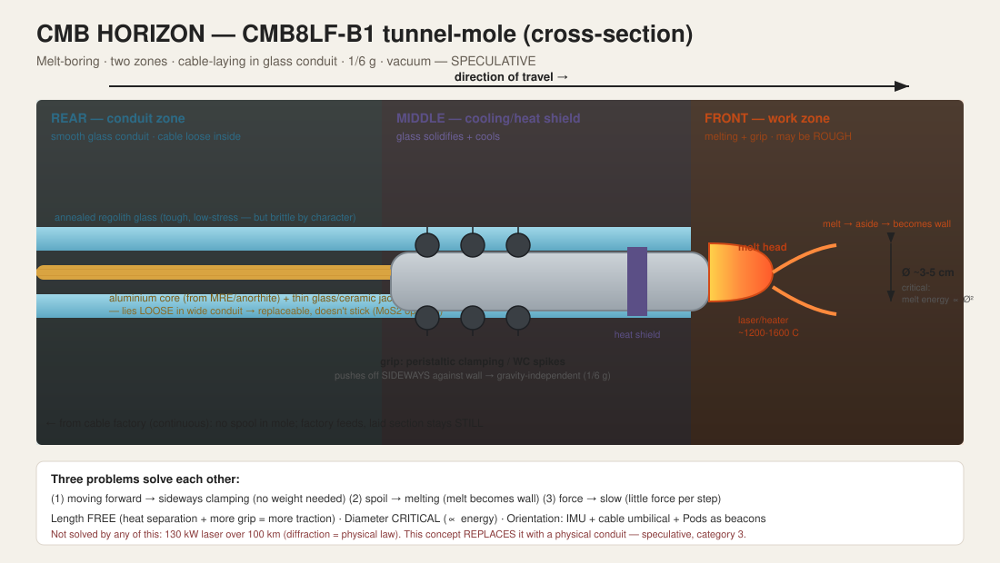
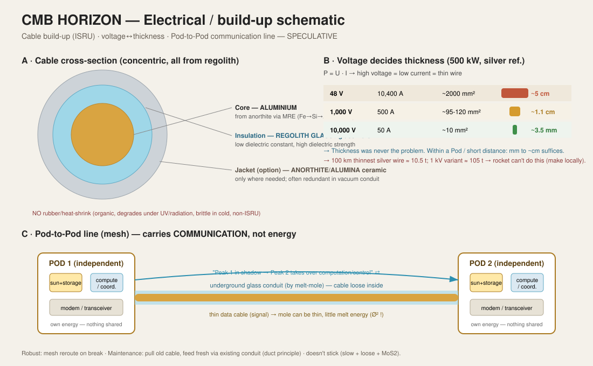
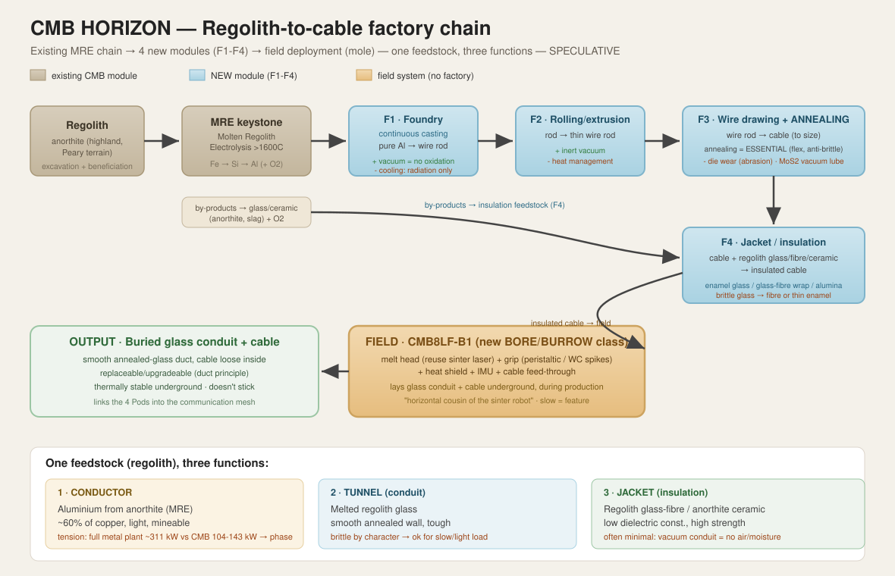

# HORIZON — ISRU Cable Network & the Tunnel-Mole

**Chrystal Moon Base — speculative / far-future chapter**

> **Status: HORIZON (speculative).** This chapter is deliberately separated from the
> hard CMB pillars (CMB8LF robots, MAST-POD, MRE chain, sequential gated-growth model).
> It describes a *far-future* extension. The physics and the sources are stated as
> honestly as possible; near-term feasibility is **not** claimed. Where something
> violates a law of physics, that is stated explicitly.
>
> Category key (used throughout):
> - **(1) Impossible by physical law** — no budget solves this.
> - **(2) Possible, but heavy/expensive** — physically allowed, practically enormous.
> - **(3) Possible and feasible** — proven technology, just not yet done on the Moon.

---

---

## Figures

*Fig. 1 — Four energetically independent Pods on Peary's rim, linked by a communication mesh.*

*Fig. 2 — CMB8LF-B1 melt-boring tunnel-mole, two-zone cross-section.*

*Fig. 3 — Cable build-up (ISRU), voltage-vs-thickness, Pod-to-Pod communication line.*

*Fig. 4 — Factory chain: existing MRE + four new modules (F1-F4) + field deployment.*

## Robot class registry (naming scheme)

CMB8LF series = **C**hrystal **M**oon **B**ase **8**-**L**egged **F**reaks. Code:
letter = class, number = generation, optional role suffix.

| Class | Meaning | Example | Status |
|---|---|---|---|
| **S** | Scale (test prototype) | CMB8LF-S1 (1:3.5 scale) | hard pillar |
| **L** | Lunar (full-size surface robot) | CMB8LF-L1, role variants L1-Sinter / L1-Dozer / L1-Watcher | hard pillar |
| **B** | **Bore / Burrow (this chapter)** | **CMB8LF-B1** — melt-boring tunnel-mole | **HORIZON (speculative)** |

> The **CMB8LF-B1** is introduced here as a *new* class. It is a horizontal,
> melt-boring cousin of the surface robots: it reuses the laser-sinter core of the
> L-class but moves and works fundamentally differently (peristaltic/spiked locomotion,
> melt-boring, cable-laying). It is **speculative** and belongs to this Horizon chapter,
> not to the proven S/L pillars.

---

## 0. Where this comes from — the reasoning chain

This concept was not invented as a "solution" and then rationalised. It is the
*end point* of an honest reasoning chain that started from a very different idea and
was tested against physics step by step. The route matters, because it shows **why**
the final form is what it is.

1. **Starting question:** four Pods on the four *peaks of (near-)eternal light* at
   Peary, to suffer less shadow downtime than with a single peak.
2. **First idea:** link those peaks with a **laser** across the crater (up to ~100 km),
   so they can share energy.
3. **Test →** that is **category (1)**: the diffraction limit and the records of
   DARPA / China / Caltech show that 100 km power transmission lies two to three orders
   of magnitude beyond the state of the art. *No budget solves this.*
4. **Second idea:** link them with **cable** instead.
5. **Test →** hauling 100 km of cable from Earth is **category (2)** but absurd: even
   the thinnest silver wire already weighs ~10.5 t (see §5). A rocket cannot reasonably
   deliver that.
6. **Breakthrough in thinking:** you do **not** need to transport the energy at all.
   Keep the Pods **energetically independent** and share only **coordination/
   communication**. Then the shadow problem is solved by *spreading locations*, not by
   transporting energy. This is **category (3)**.
7. **Consequence:** if cable is then still needed (for communication, or in a far future
   possibly power), you make it **on site** from regolith (aluminium) and lay it
   **underground** with a slow **CMB8LF-B1**. Also **category (3)**.

> **Core conclusion:** the Moon rewards those who haul nothing unnecessary. Every idea
> of the form "link two distant points with imported material or a laser beam" collides
> with a physical law (1) or with the rocket (2). The ISRU route — make everything
> locally, lay it underground, share only knowledge — is the only one that fits in
> category (3).

---

## 1. The network concept (top level)

**Four energetically independent Pods** on the four peaks of (near-)eternal light on the
rim of Peary crater (88.63°N), linked into a **meshed communication network**. The Pods
are the **nodes** (coordination) and the **beacons** (navigation for the CMB8LF-B1s that lay
the network).

### 1.1 Why four independent Pods instead of one large one

- The peaks are **narrow mountain ridges**, not plateaus (see §2). You *cannot* put
  everything on one peak — spreading is physically forced.
- As the Sun circles low around the horizon, one peak falls into terrain shadow while
  another is illuminated. Four spread Pods cover each other's dark moments →
  **combined illumination higher than any single peak.**
- Each Pod has **its own sun + its own storage + its own robots**. If one fails, the
  others keep running. No single Pod is indispensable.

### 1.2 Why link only communication, not energy

- Transporting energy over tens of km = lossy (cable: I²R loss) or physically impossible
  (laser, §4). Communication is a **signal**, not amperes → the cable can be very thin,
  the CMB8LF-B1 can be thin, you melt far less (§7.3).
- The Pods coordinate: *"Peak 1 is now in shadow — Peaks 2/3/4 take over the computation
  and control."* The shadow goal is achieved **without sending a single watt across the
  crater.**

### 1.3 The mesh topology

Full mesh between 4 points = **6 links**: 1–2, 1–3, 1–4, 2–3, 2–4, 3–4.
- **Robust / self-healing:** if 1–2 fails, traffic routes via 1–3–2 or 1–4–2. Like the
  internet: no single cable is indispensable.
- **Fits gated-growth:** build one link, prove the CMB8LF-B1, then add the next.
  *"Whatever is already laid, stays."* Every successful tunnel is permanent gain.
- **Trade-off:** 6 tunnels = 6× the work. A **ring** (1–2–3–4–1, four links) already
  gives almost all the robustness for two thirds of the work. Diagonals 1–3 and 2–4 are
  optional, for extra redundancy.

---

## 2. The location — what the sources actually say about Peary

> Standing CMB rule: material/geology/physics claims are tested against sources, not
> asserted from memory. (Origin: the "basalt fiasco" — several AIs supplied
> mare-basalt/JSC-1A data for a highland-anorthite site.)

- **Four peaks exist, documented.** Bussey et al. (2004), based on Clementine imagery:
  *four* mountainous regions on Peary's rim appear to remain illuminated for the entire
  lunar day. (Wikipedia: *Peary (crater)*; Astronomy.com.)
- **"Eternal" is not 100% — keep this honest in the repo.** LRO topography shows that no
  point on the Moon receives perpetual light during both winter and summer. The repo
  figure **~89% illumination** is therefore correct and honest; *not* 100%.
  (Wikipedia: *Peary (crater)*; arxiv 1608.01989.)
- **The peaks are narrow ridges.** The 90–99% / 100% illuminated zones are "strikingly
  thin — primarily mountain ridges and crater rims." At the south pole: "islands no more
  than a few hundred metres across in an ocean of eternal darkness."
  (arxiv 1608.01989; en-academic.) → **confirms spreading is physically necessary.**
- **Crater diameter ~79 km** (Wikipedia; sources vary 73–79 km — Peary is irregularly shaped). → four points on that rim typically
  lie **tens of km** apart; the far side may approach ~70–100 km.
- **Relevant paper for the solar case:** *"Towers on the Peaks of Eternal Light:
  Quantifying the Available Solar Power"* — Hinshelwood, Peary, Whipple; for a 2 m tall
  lander, average illumination levels rise to ~88%. (ResearchGate 349547324.)

> **Important for distances:** the exact mutual distances between the four Peary peaks
> were **not** found as a hard figure in the sources consulted. The "tens of km" is a
> **geometric estimate** from the crater diameter, not a measured value. *To be
> verified* from the "Towers on the Peaks" paper (real coordinates) before this is
> treated as hard in the design.

---

## 3. Why 100 km power transmission is NOT possible — the records (category 1)

The diffraction limit (spot diameter ≈ 2.44 · λ · L / D) is **wave physics** and holds
even in a perfect vacuum. Smaller transmit optics = *larger* spot (not smaller). The
only way to keep the spot small is a **larger** transmit aperture D.

| Demonstration | Power | Distance | Efficiency | Source |
|---|---|---|---|---|
| **DARPA POWER / PRAD** (laser, 2025) | ~0.8 kW | 8.6 km | ~20% (short range) | darpa.mil; nextbigfuture |
| Previous laser record | 0.23 kW | 1.7 km | — | darpa.mil |
| DARPA 2028 goal | 5 kW | ~193 km | — (drone **relay**) | nextbigfuture |
| **China / Xidian** (microwave, 2026) | 1.18 kW | ~100 **m** (75 m ground tower) | 20.8% | chinadaily; scmp |
| **Caltech MAPLE** (microwave, space, 2023) | LEDs lit | **30 cm** internal | — | caltech.edu |
| Caltech → Earth | **"detectable"** trace | ~500 km | negligible | caltech.edu; spaceref |

**CMB link target:** ~130 kW over 100 km. That is roughly **160× more power over 12× the
distance** than the world record — on power, distance AND efficiency at once.

- **DARPA 20%** and **China 20.8%** land independently on the same figure → this is the
  current ceiling, not coincidence.
- **Caltech** deliberately calls its Earth reception *"detectable"*: just measurable, no
  usable power. Diffraction was not bypassed — they ran into it.
- **Diffraction calculation** (λ ≈ 1 µm, L = 100 km): transmit mirror D = 1 m → spot ≈
  **240 m**. Spot back to ~10 m → D ≈ **25 m** precision optics. Larger than the biggest
  telescope on Earth. You do not sinter that from regolith.

### 3.1 The Moon advantage (honest: it helps, but does not break the wall)

The Moon **is** a better place for lasers than Earth:
- **No atmosphere** → no turbulence (no "twinkling" that smears the beam), no absorption,
  no weather. DARPA specifically tested horizontally through the thickest atmosphere as
  *worst case* — you don't have that problem on the Moon.
- **No thermal blooming** (the laser doesn't heat air that distorts the beam).
- **Free, long lines of sight** between mountain ridges.

→ On **short hops (10–30 km, neighbouring peaks)** this genuinely shifts feasibility in
your favour: there diffraction was already manageable, and without atmosphere you perform
better than any terrestrial demo. **But** for the full 100 km the diffraction/optics size
remains the wall — the Moon gives the *best* physics, not a *different* one.

---

## 4. The solution to the shadow problem (category 3)

Not transporting energy, but **spreading locations + sharing coordination**:

- 4 autonomous Pods on 4 peaks → there is almost always at least one peak in the light.
- A **mesh communication network** lets them work as one system.
- Result: **less shadow downtime than a single peak** — exactly the original goal —
  without cable or laser energy transport across the crater.

Bonus: if physical links are *eventually* added anyway (communication, or far-future
power), **relay** is the right form (short hops peak-to-peak), exactly like DARPA's drone
network. Never one 100 km jump.

---

## 5. Conductor material — what conducts, and what you can MAKE

### 5.1 Best conductors (room temperature, general)
1. **Silver** — absolute #1 (lowest resistivity).
2. **Copper** — ~5–6% worse, much cheaper → terrestrial standard.
3. **Gold** — worse than copper, doesn't corrode.
4. **Aluminium** — ~60% of copper, but much lighter (spaceflight wiring, HV lines).

> At cryogenic cold some materials become **superconducting** (resistance = 0). The
> permanently shadowed Peary floors (~30–40 K) are cold enough — **but**: HTS
> superconductors are brittle ceramics (not sinterable from regolith, must be imported),
> and your *peaks* are in the light (warm), not the shadow. Cold spot ≠ solar spot.
> → superconduction is interesting but not the practical peak link.

### 5.2 Silver on the Moon? Yes, but unmineable
- LCROSS (2009) found silver + mercury in crater Cabeus; volatile metals **migrate to
  the colder poles** (atom by atom). So the poles are relatively richest.
  (NationalGeographic; Streetwise.)
- **But** lead researcher Schultz, literally: the meagre concentration *"doesn't mean we
  can go mining for it."* The Moon lacks the **localised ore veins** that formed on Earth
  through water/tectonics/volcanism. Silver sits as loose atoms among the dust, not in
  mineable veins. (arxiv 2109.02201.)
- → **Mining silver for cable = not realistic.** It remains imported luxury for only the
  most critical small joints.

### 5.3 The ISRU conductor: ALUMINIUM from anorthite
- MRE (Molten Regolith Electrolysis) extracts **first iron, then silicon, then
  aluminium** from molten regolith by passing current through it; oxygen is a by-product.
  (Blue Origin "Blue Alchemist": Fe→Si→Al, **>1600 °C** — same keystone temperature as
  in the existing CMB factory chain.)
- Bulk aluminium comes from **anorthite**, abundant in the **highland** region = your
  Peary terrain. (ScienceDirect S0094576525002747.)
- **Ranking "conducts well AND mineable":**
  1. **Aluminium** — ~60% of copper, light, mineable via MRE. **The ISRU conductor.**
  2. Iron — mineable (even first), but a poor conductor (~16% of copper).
  3. Silicon — semiconductor; not for cable, but yes for solar cells.

> **Energy tension point (honest):** a full metal plant demands serious power. One
> source: an efficient ISRU plant = **6,776 kg hardware + 311 kW** of solar for 25 t
> metal + 23.9 t oxygen per year. CMB currently delivers **104–143 kW** → metal
> production must be **phased**, or it drives up your power budget. Not a showstopper,
> but a real design tension. (arxiv 2408.05823.)

### 5.4 How thick must a 500 kW cable be? (voltage decides everything)
Power P = U · I. It is the **current (I)** that melts, not the power. Hence high voltage
→ low current → thin wire.

| Voltage | Current (500 kW) | Silver cross-section (rough) | Diameter (rough) |
|---|---|---|---|
| 48 V | ~10,400 A | ~2,000 mm² | **~5 cm** (unwieldy) |
| 1,000 V | ~500 A | ~95–120 mm² | **~1.1 cm** |
| 10,000 V | ~50 A | ~10 mm² | **~3.5 mm** (thinner than a pencil) |

> Conclusion: **cable thickness was never the problem.** Within a Pod / over short
> distance a few mm to ~1 cm is enough. The problem was always the **100 km distance +
> the laying**, not the thickness. Lunar cold helps (lower resistance, better cooling in
> shadow); vacuum works against cooling in the light (no convection). Figures are the
> *melt* limit, not the efficiency optimum.

### 5.5 Why hauling 100 km of cable is impossible (category 2, but absurd)
- Thinnest variant (3.5 mm, 10 mm² silver) × 100 km = **1 m³ silver ≈ 10.5 t**.
- 1 kV variant (~1 cm, 100 mm²) = **~105 t** — six or seven Falcon Heavy flights, purely
  for cable.
- → One cable devours your entire mission budget. **So make it on site.**

---

## 6. Insulation / jacket — from the same regolith (category 3)

**No rubber, no heat-shrink, no imported plastic** (organic, degrades under UV/radiation,
brittle at lunar-night cold, not ISRU). The jacket comes from your own feedstock.

- **Regolith glass is itself an excellent electrical insulator**: low dielectric
  constant, high dielectric strength. Glass fibre can be made **directly from the soil**
  or from **by-products of metal production** (anorthite, slag from Al/Ti extraction).
  (ResearchGate 268564326.)
- **Anorthite ceramic** (CaO·Al₂O₃·2SiO₂): very low dielectric constant, used as
  substrate for electronics/solar cells. (NASA Ray/Ramachandran.)
- **Alumina (Al₂O₃)**: classic technical insulator, high strength + insulation; comes
  from your own aluminium chain. (ScienceDirect S0955221926001998.)
- A source summarises it: regolith → "construction material, insulation (thermal AND
  **electrical**), radiation shielding, containers." (ScienceDirect S0022309326000517.)

**Three ISRU jacket options:**
1. **Enamelled glass jacket** — draw the cable through molten regolith glass (like
   enamelled copper wire: a glassy lacquer layer, no rubber). Fits your melt technique.
2. **Glass-fibre wrap** — more flexible than a solid glass layer (fibres bend, a glass
   plate breaks). Attractive for a cable you draw through a conduit.
3. **Anorthite/alumina ceramic coating** — for heavy insulation / high voltage.

> **Do you even need the jacket over the full length?** In the glass conduit, in vacuum,
> there is no air and no moisture — the two causes of short circuits on Earth. If the
> cable lies **loose** in its conduit (touches no metal), full insulation may be
> unnecessary. **Insulate where needed** (joints, feed-throughs, at the Pods), not
> blindly everywhere. Saves a lot of material and energy. — Glass remains **brittle by
> character** (does not bend plastically): choose glass fibre or a very thin enamel over
> a thick rigid glass tube.

---

## 7. The CMB8LF-B1 tunnel-mole — operation (category 3)

Goal: lay an underground **glass conduit** holding the (communication or power) cable.
Underground, because regolith shields against micrometeorites, thermal swing and
radiation.

### 7.1 Three problems that solve each other
| Lunar problem | Normal approach fails because… | Mole solution |
|---|---|---|
| **Moving forward** (1/6 g: too light to push off) | pushing against ground → slips backward | **peristaltic clamping** sideways against the wall (grip force self-generated, gravity-independent) |
| **Spoil removal** (clogs a long thin tunnel) | digging produces soil with nowhere to go | **melting** instead of digging → melt pushed aside, solidifies into the wall. No removal. |
| **Force/precision** | brute force unavailable | go **slow** → little force per step. "Slow is a feature." |

### 7.2 Two zones (an important design correction)
The CMB8LF-B1 treats the wall in **two physically separate zones**:
- **FRONT (work zone):** melt head + grip. May be **rough** — here you actually want
  grip. Fresh, just-solidified glass; spikes/clamps bite/grip here.
- **REAR (conduit zone):** the final **smooth** glass conduit in which the cable lies.
  No longer touched by the CMB8LF-B1; it is "done."
→ No contradiction between "grip" and "smooth": they are different tunnel sections. Any
spike debris is **re-melted** into the wall by the melt head.

### 7.3 Diameter is critical, length is free
- **Melt energy scales with diameter² (πr²).** A hole 2× wider = **4×** energy. → make
  the hole **as narrow as the cable allows**.
- **Length is allowed (and required):** length gives (a) thermal separation between hot
  head and cool grip zone, and (b) more grip contact points = more traction. Thin-and-
  long do not fight; they point the same way.
- **Lower bound on diameter** = not the melt physics, but the **internal packing**:
  cable + feed-through + melt head + heat shield + grip + control must fit side by side.
  Rough estimate **~3–5 cm** (an informed guess, not a calculated fact).

### 7.4 Locomotion — options and trade-off
| Method | Advantage | Drawback | Fits CMB? |
|---|---|---|---|
| **Peristaltic clamping** | gentle, little force, no scratching, no debris | clamp timing + heat separation | **best** — fits "slow & light", preserves smooth wall |
| **Spiked grip wheels** (WC, non-magnetic) | mechanically simple, grip-by-bite, gravity-independent | scratching/debris (front → re-melted), bearings = cold-weld risk | option, with MoS₂ |
| **Screw locomotion** | continuous, elegant | rotation costs torque; grip slips on smooth glass; dig function redundant | least suitable for a *melter* |

> **Spike material:** "hard + non-magnetic + non-brittle" is a **trilemma** — pick two.
> Best bet: **tungsten carbide with a non-magnetic binder (nickel instead of cobalt)**.
> Ceramic = hard + non-magnetic but **brittle**. Titanium = non-magnetic + tough but
> **softer** (scratches). Non-magnetic is desired: (a) iron dust doesn't cling, (b) it
> doesn't disturb the magnetically levitated MAST-POD bearing.

### 7.5 Underground orientation — one of the hardest sub-problems
On the Moon the easy methods fall away: **no GPS** (no lunar nav-sats), **no compass**
(no global magnetic field), **no sight** (underground). What remains, in combination:
- **IMU (inertial navigation):** gyros + accelerometers integrate every motion. Weakness:
  **drift** (errors accumulate over distance) → re-calibration needed.
- **The cable as umbilical:** "back" always known + a **communication line** to base,
  which co-computes and sends corrections.
- **Pods as beacons + known target coordinates:** each mole digs from a **known** Pod to
  a **known** Pod → not exploring, only holding course to a fixed point; beacons
  re-calibrate the IMU drift.

### 7.6 Cable sticking — solved by slowness + looseness
- **Mechanism A — bonding to still-soft glass:** go **slow enough** that the wall is
  **fully solidified** before the cable arrives → **category: solved** (your insight,
  100% correct).
- **Mechanism B — cold welding (vacuum adhesion, even between cold hard surfaces):**
  slowness doesn't address this directly, **but**: (a) **wide conduit** → cable barely
  touches the wall; (b) **glass-against-aluminium** (dissimilar materials) welds far less
  than metal-on-metal; (c) **MoS₂** for certainty. → together practically excluded.

### 7.7 Production + laying combined — and the "duct" advantage
- The **cable factory produces continuously** and the CMB8LF-B1 **lays during production**
  (needle-and-thread): the laid section stays **still**, only fresh material is added →
  avoids the drag friction of "pulling the entire length forward."
- **Repair/upgrade = cheap:** the expensive step (melting the tunnel) is done **once**.
  Glass on the Moon does not decay. On cable break: pull the old cable out, feed a fresh
  one through the **existing conduit** — no mole, no melt energy. You have reinvented the
  **conduit/duct principle**: tunnel = permanent infrastructure, cable = replaceable
  contents. Condition: cable **loose** in a **wide, smooth** conduit (the same choice
  that also solves friction AND sticking — three birds, one stone).

---

## 8. Required factories (factory-landscape extension: 22 → 26)

> Existing chain: ~20 modules, MRE keystone ~1600 °C. The modules below connect directly
> to it (sharing heat/feed/feedstock). All processes are centuries-old, proven technology
> on Earth — **none** of them hits a physical law (other than §3).

| # | Module | Input → Output | Lunar advantage | Lunar challenge |
|---|---|---|---|---|
| **F1** | **Foundry** (continuous casting) | pure Al (from MRE) → wire rod | **vacuum = no oxidation**; can run directly from the MRE melt (less reheating) | cooling only via radiation/conduction |
| **F2** | **Rolling / extrusion** | rod → thin wire rod | inert vacuum | heat management |
| **F3** | **Wire drawing + ANNEALING** | wire rod → cable (to size) | vacuum = clean | **die wear** (regolith abrades) + **MoS₂** vacuum lubrication needed; annealing against brittleness |
| **F4** | **Jacket / insulation unit** | cable + regolith glass/fibre/ceramic → insulated cable | feedstock = MRE by-product | brittle glass → fibre or thin enamel |

Plus the **field system** (not a factory, but the deployment platform):
- **CMB8LF-B1 (new BORE/BURROW class):** melt head (laser/heater, reusing the sinter
  technique) + grip (peristaltic / WC spikes) + heat shield + IMU + cable feed-through.
  *A horizontal cousin of the sinter robot.*

> **Annealing** in F3 is **not an optional step but essential:** cold-drawn Al becomes
> hard/brittle → would break during laying. Annealing makes it pliable again. Same for
> the tunnel glass: **slowly** solidified/annealed glass is far tougher and lower-stress
> — **but remains brittle by character** (does not bend plastically). For the gentle,
> slow, lightly-loaded situation here that is no practical problem; the nuance must
> nonetheless be stated in the dossier (ESA credibility).

---

## 9. Honest final balance

**What works (category 3):**
- 4 energetically independent Pods, mesh-linked for **communication/coordination**.
- Shadow goal achieved via **spreading + coordination**, not via energy transport.
- **Aluminium** conductor from anorthite (MRE), **glass/ceramic** insulation from the
  same regolith — one feedstock, three functions (conductor, tunnel, jacket).
- A **slow CMB8LF-B1** lays a smooth glass **duct**; cable loose inside → replaceable/
  upgradeable, does not stick.

**What does not work (category 1) — state honestly in every public piece:**
- **130 kW laser over 100 km**: two to three orders of magnitude beyond DARPA/China/
  Caltech. Diffraction is a physical law; no budget and no lunar vacuum solves it. Short
  hops (10–30 km) are a different story and there the vacuum does help.

**Open points / to verify:**
- Real mutual **distances** between the 4 Peary peaks (from "Towers on the Peaks").
- Mole **lower-bound diameter** (depends on melt technique + power choice).
- **Energy balance** metal plant vs. CMB power (311 kW vs. 104–143 kW → phasing).

---

## 10. Sources (consulted, this chapter)

**Power beaming / records**
- DARPA POWER/PRAD — darpa.mil/news/2025/darpa-program-distance-record-power-beaming
- NextBigFuture — DARPA 800 W @ 8.6 km; goal 5 kW @ 120 mi (drone relay)
- China / Xidian "Sun Chasing" — chinadaily.com.cn; scmp.com (1.18 kW @ ~100 m, 20.8%)
- Caltech MAPLE / SSPD-1 — caltech.edu; spaceref.com ("detectable" to Earth; 30 cm internal)

**Peary / peaks of eternal light**
- Wikipedia — *Peary (crater)* (4 peaks, Bussey 2004; ~79 km; no perpetual light)
- Astronomy.com / Space.com — *Eternal light at a lunar pole* (cite 73 km / 45 mi; sources vary)
- arxiv 1608.01989 — *The Peaks of Eternal Light* (narrow ridges; 90–99%/100% map)
- ResearchGate 349547324 — *Towers on the Peaks of Eternal Light* (solar power, ~88%)

**Silver / regolith metals**
- NationalGeographic / Streetwise — LCROSS silver+mercury, polar migration, "not mineable"
- arxiv 2109.02201 — no localised ore veins on the Moon
- Blue Origin "Blue Alchemist" — MRE Fe→Si→Al, >1600 °C
- ScienceDirect S0094576525002747 — Al from anorthite (highland), molten-salt electrolysis
- arxiv 2408.05823 / ScienceDirect S0094576522006579 — ISRU plant: 6776 kg + 311 kW → 25 t/a

**Insulation / glass-ceramic from regolith**
- ResearchGate 268564326 — glass fibre from regolith/by-products; low ε, high dielectric strength
- ScienceDirect S0955221926001998 — Al₂O₃ ceramic (strength + insulation), regolith joining
- ScienceDirect S0022309326000517 — regolith → incl. electrical insulation
- NASA Ray/Ramachandran — anorthite ceramic, low dielectric constant

**KRUSTY (reference energy, separate chapter)**
- nasa.gov; tandfonline 00295450.2020.1725382; atomicinsights — 1 kWe, 5 kWt, ~$18–20M

---

*End of HORIZON chapter. Speculative; separated from the hard CMB pillars. Physics and
sources as honest as possible; near-term feasibility not claimed.*
